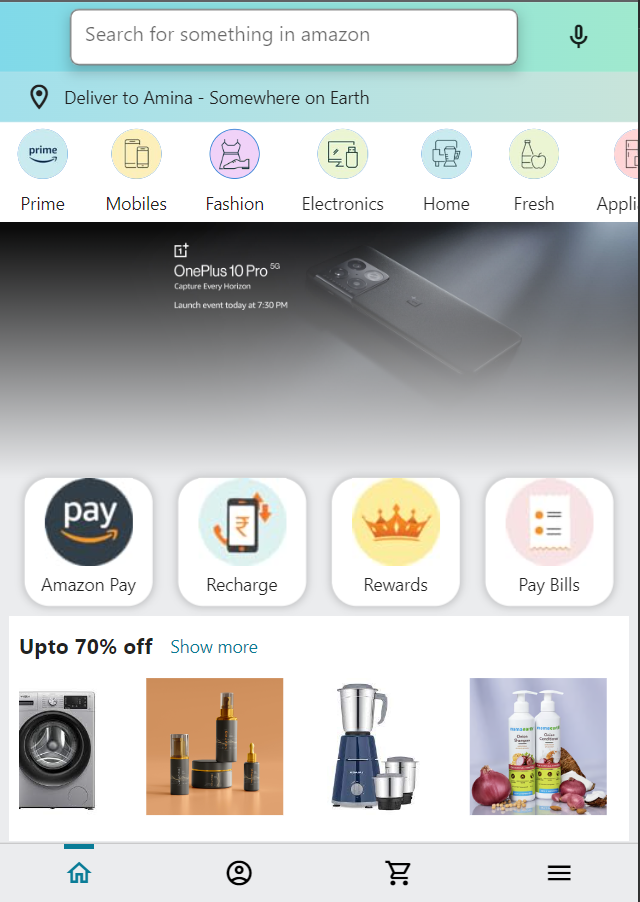
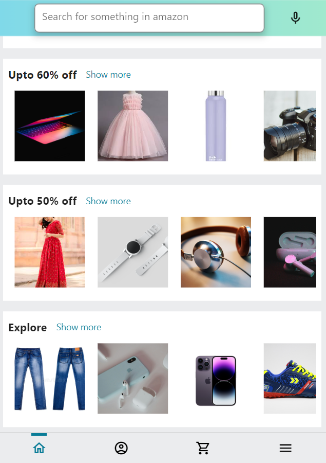
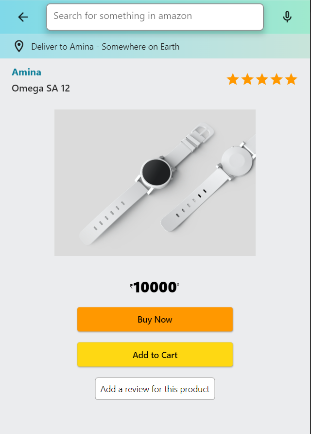

# amazon_clone

In this repository contains functional Amazon Clone with the cross-platform framework, Flutter, with the backend as Firebase.
With Authentication, Database Integration, State Management, Firebase Storage, Firebase Firestore, and much more!

## Roles and Interactions Flowchart

This flowchart demonstrates the key roles (User, Seller, and Admin) and their interactions within platform.

## Screenshots

| Sign-In Screen                                | Sign-Up Screen                                      |
| --------------------------------------------- | --------------------------------------------------- |
|          |                |
| Home Screen                                   | Home Screen                                         |
|           |                |
| Account Screen                                | Sell Screen                                         |
|  |        |
| Cart Screen                                   | More Screen                                         |
|      |            |
| Product Screen                                | Review Add                                          |
|        |  |
| Search Screen                                 |
|    |

